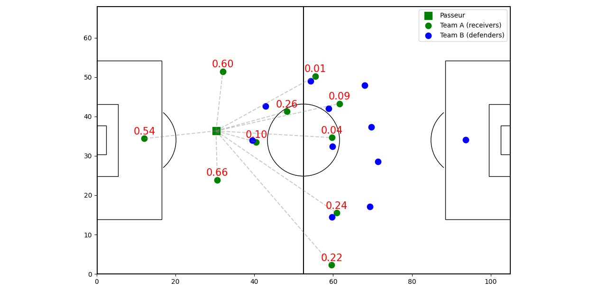
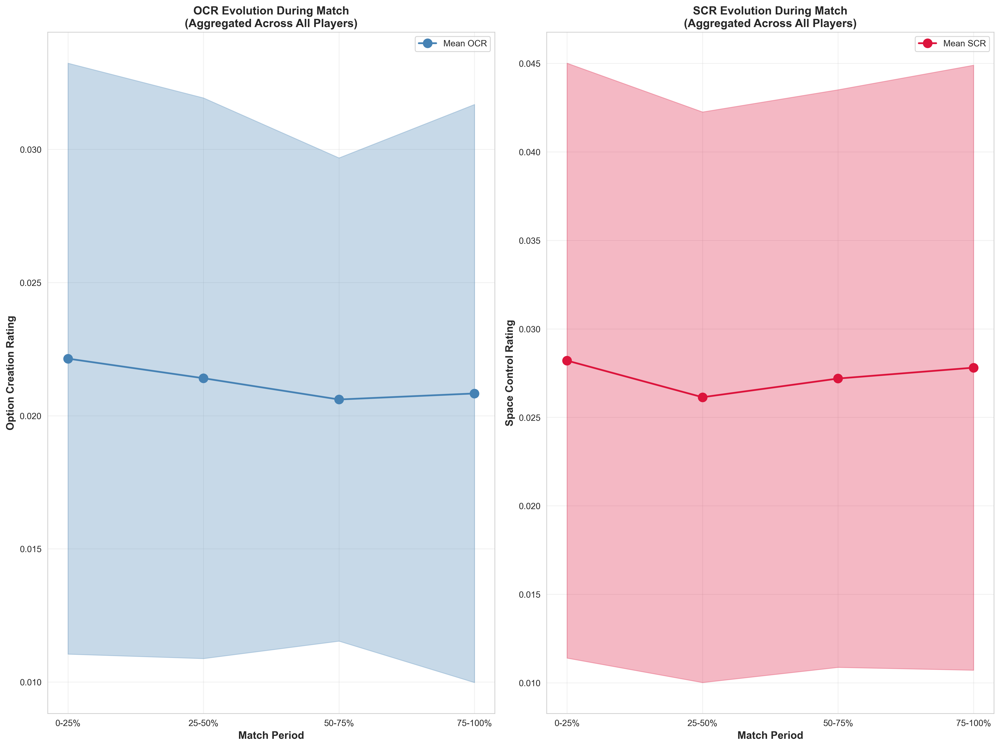

# The Off-Ball Rating: A Comprehensive Framework for Evaluating Player Movement Without Possession

## Introduction

Football analytics has predominantly focused on on-ball actions, despite the fact that players spend approximately **97% of match time without the ball**. This work introduces the **Off-Ball Rating (OffBR)**, a novel framework designed to quantify the quality of player movement during non-possession phases.

While established metrics such as VAEP or EPV successfully value on-ball contributions, off-ball impact remains largely unmeasured. OffBR aims to bridge this gap by providing a transparent and interpretable assessment of off-ball behavior using player tracking data.

## Methods

OffBR is composed of two complementary ratings computed from XY tracking data.

1. The **Option Creation Rating (OCR)** captures offensive off-ball value through a **Passing Option Value (POV)** proxy. For each off-ball attacker and frame, POV is defined as the geometric mean of:
- the probability of successfully receiving a pass, and  
- the Expected Threat (xT) value at the player’s position.

Offside positions are assigned zero value. Reception probability incorporates distance decay and geometric defender obstruction based on angular interference and proximity to the passing lane. OCR is obtained by averaging POV values over rolling 2-second windows across the match.

2. The **Space Control Rating (SCR)** evaluates defensive positioning through two mechanisms:
- **Zone coverage**, identifying high-xT locations occupied by attackers without a defender within a control radius (R = 3 m), and assigning defenders a coverage ratio.
- **Pass line blocking**, measuring defender proximity to potential passing lanes from the ball carrier (threshold S = 1 m).

SCR is computed as an equally weighted combination of both components and averaged over rolling 1-second windows.

The final **OffBR** is defined as the ordered pair **(OCR, SCR)**. Keeping both dimensions separately enables richer and more interpretable player profiling. All computations rely solely on geometric proxies, ensuring transparency and avoiding machine learning complexity.

## Results

Applied to **10 A-League matches** (309 player-match observations), OffBR reveals consistent tactical patterns. Midfielders exhibit the highest OCR values (mean = 0.0209), reflecting their central role in option creation, while forwards record the highest SCR values (mean = 0.0329), highlighting their contribution to defensive pressure. Full-backs display the most balanced profiles (OCR/SCR ratio = 0.97), followed by wide attackers (0.74).

Temporal analysis shows that OCR decreases steadily over match duration, while SCR remains stable, suggesting that offensive movement quality degrades with fatigue whereas defensive positioning is better maintained.

## Conclusion

OffBR addresses a critical blind spot in football analytics by quantifying off-ball contributions that remain invisible in traditional metrics. Its dual-component structure provides a nuanced and interpretable representation of player behavior. Future work (conditioned to having enough data) will focus on assessing the predictive power of OffBR with respect to match outcomes, particularly in modern football where success increasingly depends on off-ball organization, pressing, and spatial control.